# Chat API

## Development

### Create venv (Python 3.10+)

Run these from the project root:

```bash
python3 -m venv .venv
source .venv/bin/activate
pip install --upgrade pip
pip install --upgrade setuptools
```

### Install package in editable mode

```bash
pip install -e ".[websockets,fastapi]"
```

### Run tests (manually)

```bash
python tests/test_flow.py
```

## Installation
Base installation:
```bash
pip install "chat_api @ git+https://github.com/qatarai/chat_api.git"
```
Installing ready-to-use extensions for WebSockets and FastAPI (optional):
```bash
pip install "chat_api[websockets,fastapi] @ git+https://github.com/qatarai/chat_api.git"
```

## Usage

Generally, the steps are:
1. Implement the `Transport` interface to suit your custom use case (e.g., WebSockets, HTTP, etc.). Note: we provide the `WebsocketsTransport` and `StarletteTransport` implementations for convenience.
2. Create a `Server` or `Client` instance, passing in your transport.
3. Start sending/receiving events.

Refer to the examples in the `tests` directory for more details.
<!--  -->

## Sequence diagram

```mermaid
sequenceDiagram
    autonumber

    participant C as Client
    participant S as Server

    Note over C,S: Audio/Video bytes stream in chunks.
    Note over C,S: Text may stream via repeated OutputText events.
    Note over C,S: Transcriptions may stream via repeated OutputTranscription events.
    Note over C,S: FunctionCall does not stream.
    Note over C,S: Legend<br/>blue = Client to Server<br/>green = Server to Client

    rect rgba(51,136,255,0.18)
        Note over C,S: Config Event<br/>- event_type: EventType.CONFIG<br/>- chat_id: uuid?<br/>- input_mode: InputMode<br/>- output_text: bool<br/>- output_audio: bool<br/>- output_video: bool<br/>- silence_duration: float (ms, -1 => device)
        C->>S: Config
    end

    rect rgba(76,175,80,0.18)
        Note over C,S: ServerReady<br/>- event_type: EventType.SERVER_READY<br/>- chat_id: uuid<br/>- request_id: uuid
        S-->>C: ServerReady
    end

    alt input_mode = Audio
        par Input audio chunks
            loop Input audio chunks
                rect rgba(51,136,255,0.18)
                    Note over C,S: Input (Audio)<br/>- bytes: audio
                    C-->>S: Audio Chunk
                end
            end
        and Transcriptions (partial/final)
            loop Output transcription events
                rect rgba(76,175,80,0.18)
                    Note over C,S: OutputTranscription<br/>- event_type: EventType.OUTPUT_TRANSCRIPTION<br/>- transcription: Transcription
                    S-->>C: OutputTranscription
                end
            end
        end
        alt silence_duration = -1 (device detection)
            rect rgba(51,136,255,0.18)
                Note over C,S: InputEnd<br/>Condition: input_mode = Audio AND silence_duration = -1<br/>- event_type: EventType.INPUT_END
                C->>S: InputEnd
            end
        else silence_duration > -1 (server detection)
            rect rgba(76,175,80,0.18)
                Note over C,S: InputEnd<br/>Condition: input_mode = Audio AND silence_duration > -1<br/>- event_type: EventType.INPUT_END
                S-->>C: InputEnd
            end
        end
    else input_mode = Text
        rect rgba(51,136,255,0.18)
            Note over C,S: InputText<br/>- event_type: EventType.INPUT_TEXT<br/>- data: string
            C->>S: InputText
        end
        rect rgba(51,136,255,0.18)
            Note over C,S: InputEnd<br/>Condition: input_mode = Text<br/>- event_type: EventType.INPUT_END
            C->>S: InputEnd
        end
    end

    rect rgba(51,136,255,0.18)
        Note over C,S: Interrupt<br/>Condition: can occur at any time<br/>- event_type: EventType.INTERRUPT<br/>- interrupt_type: InterruptType
        C->>S: Interrupt
    end

    loop For each stage
        rect rgba(76,175,80,0.18)
            Note over C,S: OutputStage<br/>- event_type: EventType.OUTPUT_STAGE<br/>- id: uuid<br/>- parent_id: uuid<br/>- title: string<br/>- description: string
            S-->>C: OutputStage
        end

        rect rgba(76,175,80,0.18)
            Note over C,S: OutputContent<br/>- event_type: EventType.OUTPUT_CONTENT<br/>- id: uuid<br/>- type: ContentType<br/>- stage_id: uuid
            S-->>C: OutputContent
        end

        rect rgba(76,175,80,0.18)
            Note over C,S: OutputContentAddition<br/>- event_type: EventType.OUTPUT_CONTENT_ADDITION<br/>- content_id: uuid<br/>- …
            S-->>C: OutputContentAddition
        end

        alt type = ContentType.Audio
            loop Audio data chunks
                rect rgba(76,175,80,0.18)
                    Note over C,S: Data (Audio)<br/>Info: each chunk prefixed with uuid (16 bytes)<br/>- uuid: uuid (16 bytes)<br/>- bytes: audio
                    S-->>C: Audio Chunk
                end
            end
        else type = ContentType.Video
            loop Video data chunks
                rect rgba(76,175,80,0.18)
                    Note over C,S: Data (Video)<br/>Info: each chunk prefixed with uuid (16 bytes)<br/>- uuid: uuid (16 bytes)<br/>- bytes: video
                    S-->>C: Video Chunk
                end
            end
        else type = ContentType.Text
            loop Text data chunks
                rect rgba(76,175,80,0.18)
                    Note over C,S: OutputText<br/>- event_type: EventType.OUTPUT_TEXT<br/>- data: string (chunk)
                    S-->>C: Text Chunk
                end
            end
        else type = ContentType.FunctionCall
            rect rgba(76,175,80,0.18)
                Note over C,S: OutputFunctionCall<br/>- event_type: EventType.OUTPUT_FUNCTION_CALL<br/>- data: string (json)
                S-->>C: FunctionCall
            end
        end
    end

    rect rgba(76,175,80,0.18)
        Note over C,S: OutputEnd<br/>- event_type: EventType.OUTPUT_END
        S-->>C: OutputEnd
    end
```



## Message specification

### Client → Server

- Config
  - event_type: EventType.CONFIG (int)
  - chat_id: uuid (string, optional)
  - input_mode: InputMode (int)
  - output_text: bool
  - output_audio: bool
  - output_video: bool
  - silence_duration: float (milliseconds; -1 enables on-device silence detection; only used for InputMode.Audio)

- Input (Audio)
  - bytes: audio (binary, streamed in arbitrary chunk sizes)

- InputText
  - event_type: EventType.INPUT_TEXT (int)
  - data: string

- InputEnd (only when input_mode = Audio and silence is detected on device)
  - event_type: EventType.INPUT_END (int)

- Interrupt
  - event_type: EventType.INTERRUPT (int)
  - interrupt_type: InterruptType (int)

### Server → Client

- ServerReady
  - event_type: EventType.SERVER_READY (int)
  - chat_id: uuid (string)
  - request_id: uuid (string)

- OutputTranscription
  - event_type: EventType.OUTPUT_TRANSCRIPTION (int)
  - transcription: Transcription

- InputEnd (only when input_mode = Audio and silence is detected by server)
  - event_type: EventType.INPUT_END (int)

- OutputStage
  - event_type: EventType.OUTPUT_STAGE (int)
  - id: uuid (string)
  - parent_id: uuid (string)
  - title: string
  - description: string

- OutputContent
  - event_type: EventType.OUTPUT_CONTENT (int)
  - id: uuid (string)
  - type: ContentType (int)
  - stage_id: uuid (string)

- OutputContentAddition
  - event_type: EventType.OUTPUT_CONTENT_ADDITION (int)
  - content_id: uuid (string)
  - …: additional metadata (implementation-defined)

- Data (Audio)
  - uuid: uuid (16 bytes; per-content stream chunk identifier)
  - bytes: audio (binary, streamed)

- Data (Video)
  - uuid: uuid (16 bytes; per-content stream chunk identifier)
  - bytes: video (binary, streamed)

- OutputText (streamed; multiple events allowed)
  - event_type: EventType.OUTPUT_TEXT (int)
  - content_id: uuid (string)
  - data: string (chunk)

- OutputFunctionCall
  - event_type: EventType.OUTPUT_FUNCTION_CALL (int)
  - content_id: uuid (string)
  - data: string (JSON-encoded function call)

- OutputEnd
  - event_type: EventType.OUTPUT_END (int)

## Enums (all integer-valued)

- InputMode
  - 0: AUDIO
  - 1: TEXT

- ContentType
  - 0: AUDIO
  - 1: VIDEO
  - 2: TEXT
  - 3: FUNCTION_CALL

- EventType
  - 0: CONFIG
  - 1: INPUT_TEXT
  - 2: INPUT_MEDIA
  - 3: INPUT_END
  - 4: INTERRUPT
  - 5: SERVER_READY
  - 6: OUTPUT_TRANSCRIPTION
  - 7: OUTPUT_STAGE
  - 8: OUTPUT_CONTENT
  - 9: OUTPUT_CONTENT_ADDITION
  - 10: OUTPUT_TEXT
  - 11: OUTPUT_MEDIA
  - 12: OUTPUT_FUNCTION_CALL
  - 13: OUTPUT_END

- InterruptType
  - 0: USER
  - 1: SYSTEM

## Notes
- `uuid` refers to standard UUID string identifiers unless otherwise specified.
- The 16-byte `uuid` fields in media `Data` messages are UUID identifiers scoped to a content stream, used to correlate chunks.
- Audio/Video/Text data may be streamed in chunks; FunctionCall payloads are not chunked.
